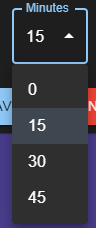
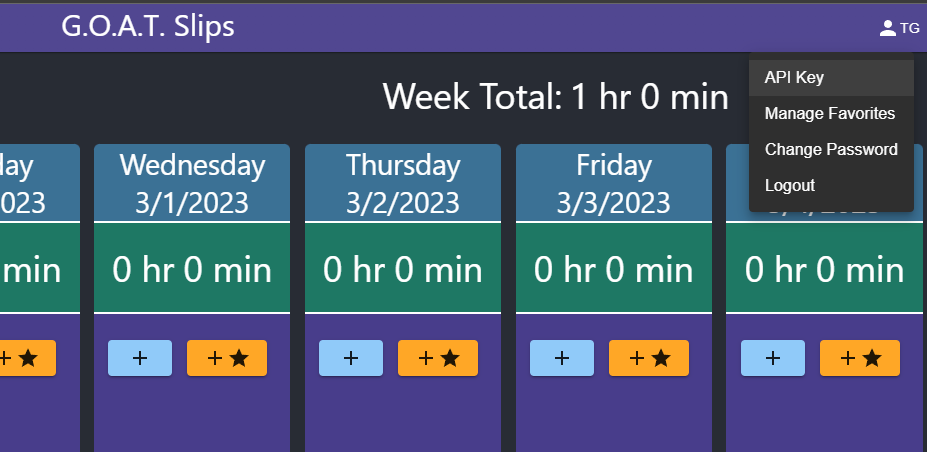
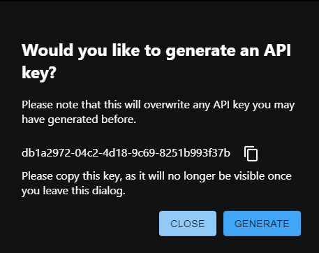
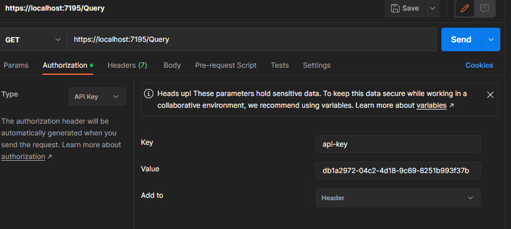

# Summary

G.O.A.T. Slips or Greatest Of All Time Slips is a time tracking application. It allows users to enter hours and minutes categorized by date, project code, task code, and labor code.

The application is split into 3 parts:

- Database: SQL Server database
- Server: .NET 6 Web API
- Client: React Application built with TypeScript, utilizing Material UI.

# Debugging the application

## Database

Begin by creating a blank SQL Server database and deploying the scripts in the `db` folder to it. You can use the database project (`db/GoatSlipsDb.sln`) to deploy these scripts.

Ensure that the `db/GoatSlipsDb/AddAccessRights.sql` script is ran on the target db once the schema has been deployed.

## Server

Open the .NET 6 Web API solution (`src/GoatSlips.sln`).

Edit the `src/GoastSlips/appsettings.Development.json` file.

- Set the `ConnectionStrings/ConnectionString` configuration to a connection string pointing to the database created in the steps outlined above. A sample connection string is `"Server=localhost\\SQLEXPRESS;Database=GoatSlipsDb;Trusted=Connection=True"`.

Begin debugging the `GoatSlips` project.

## Client

The client React app can be found in the `src/GoatSlips/Client` folder.

Edit the `src//.env` file and ensure the `REACT_APP_API_ENDPOINT` is set to the URL of the debugging instance of the `GoatSlips` project from the steps above.

Debugging the GoatSlips .NET project will automatically run the following commands to install dependencies for and start up the react app:

1. `npm install`
2. `npm run start`

# Deploying the application

Deploying the application requires:

1. Updating the `src/GoatSlips/Client/.env` file to point to the target URL of the application.
2. Publishing the GoatSlips.csproj.
3. Setting necessary configurations in the published `appsettings.json` file.
4. Creating a website in IIS that points to the published directory.

Steps 1, 2, and 3 are handled by the `publish.sh` script. Run this interactive script and it will prompt you for all necessary configuration options and the directory where the published application should be placed.

In IIS, a website or application must be pointed to the folder location of the published files. The application pool used by that website should use an identity user with access to the GoatSlipsDb server. This can be found in the advanced settings of the application pool, under `Process Model` > `Identity`.

# Configuration

The application has some configurable functionality which is accessible from the "Manage Configurations" page.

## Minutes Partition

The selectable minutes on a new time slip is free entry between 0 and 60, by default, but it can be configured to only allow 15 or 30 minute increments. When 15 or 30 is selected, the minutes input is replaced with a dropdown with only the allowed values.

## Make API calls programmatically

To make API calls for a specific user from external programs, you can generate an API key from the G.O.A.T. Slips application.

From the user (top right) menu, click "API Key" to open a modal that will provide you with the option to generate an API key.

There is only one API key for each user, and it is only saved as a hash, so it will not be retrievable after its initial generation. This means that each time an API key is generated, the prior key for that user will be decommissioned and it will no longer work.

To use the key, just add a header with they key "api-key" and the value of the generated API key. Here is an example using [Postman](https://www.postman.com/):

# License

G.O.A.T. Slips is licensed under the [GNU GPLv3 License](https://github.com/TeeGree/goat-slips/blob/main/LICENSE.md).
